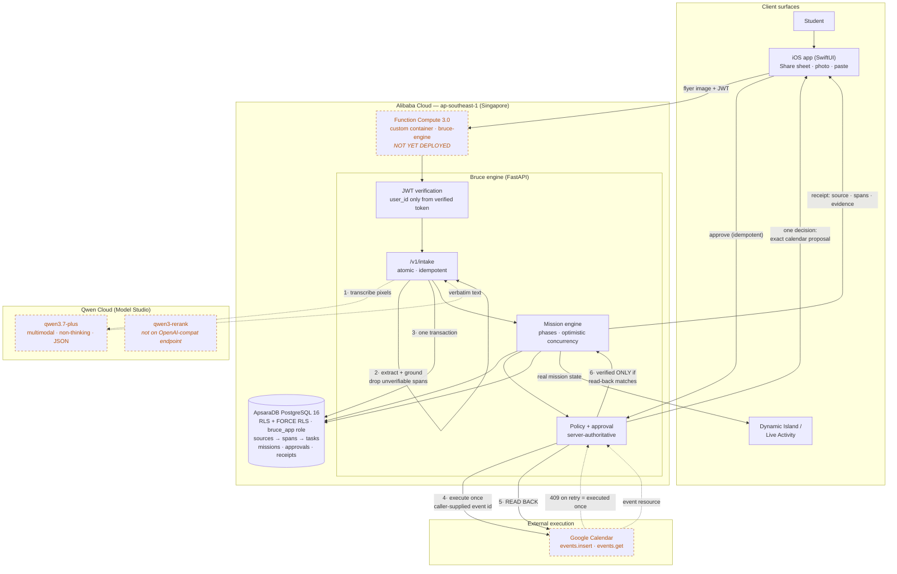

# Bruce — architecture

> **Honest status (2026-07-16).** Solid arrows are implemented and tested. Dashed arrows are
> implemented but **never executed against the live third party**, because the Qwen Cloud account is
> under a risk-control hold and no Alibaba deployment exists yet. See
> [deployment-verification.md](deployment-verification.md). Nothing on this diagram should be read
> as "working in production" unless that document says so.

## The demonstrated flow

## The one thing this architecture is built around

**A write is a claim; a read-back is evidence.** Two places enforce it, and neither can be bypassed:

- **Grounding.** The model never gets to assert a deadline. Every extracted deadline carries the
  verbatim `source_span` it came from, and `_verify_deadlines` drops any span not literally present
  in the source text. The image path transcribes pixels *first* precisely so this same gate has a
  real source text to check against — a single image→JSON call would produce spans checkable only
  against the model's own claim about the image, making a hallucinated deadline unfalsifiable.
- **Execution.** A calendar event is `verified` only after an independent `events.get` returns a
  matching title and start. Missing, mismatched, or cancelled → not verified.

## Where the guarantees actually live

| Guarantee | Enforced by | Not by |
|---|---|---|
| Tenant isolation | Postgres RLS + `FORCE RLS`, restricted `bruce_app` role | application `WHERE` clauses |
| Intake idempotency | `UNIQUE(user_id, idempotency_key)` on `sources` | check-then-insert |
| Calendar execute-once | Google rejecting a duplicate caller-supplied event id (409) | local "already done" state |
| Mission concurrency | optimistic `version` column | in-process locks |
| Evidence lineage | FK chain `sources → source_spans → tasks` | log lines |

Each of these is a remote/database arbiter on purpose: a process crash, a retry, or a redelivered
webhook cannot corrupt them.

## Qwen Cloud's exact role

Qwen is the **multimodal intake brain** — it reads flyers, screenshots, forms and PDF pages that
have no text layer, and turns them into grounded structure. It is deliberately *not* trusted to
execute anything: it never calls a tool, never writes to the database, and never decides whether an
action is allowed. Extraction is data; policy and execution are Bruce's.

- `qwen3.7-plus`, **non-thinking** (`enable_thinking: false`) — a thinking-mode response must never
  be relied on to *be* the action JSON.
- `qwen3-rerank` (planned, Q3) — ranks *already-eligible* opportunities only, after deterministic
  filters. It can never override a hard constraint (grade, citizenship, deadline, cost).
- **No silent fallback.** If Qwen is unavailable the intake path returns `503 provider_unavailable`.
  Answering with a different provider while claiming a Qwen-powered workflow would be a lie.
