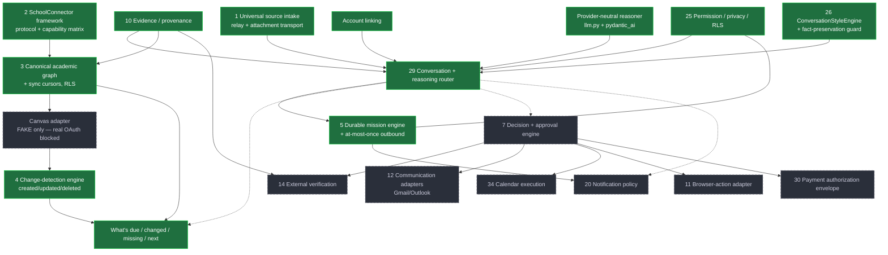

# Capability Dependency Map (v1)

How the shared platform primitives depend on each other, so we build leverage nodes first and avoid
fake breadth. Solid = built/deployed (Bite 1); dashed = planned. IDs map to `product/capabilities.yaml`.

## Reading it
- **Everything routes through the conversation runtime (29)** — it's the single entry point the
  built primitives feed and the planned ones will hang off of.
- **SchoolConnector (2) → academic graph (3) → change detection (4) → the north-star queries are now
  BUILT** (provider-neutral, RLS-isolated, migration 0012), validated end-to-end against a FAKE Canvas
  adapter. The real Canvas leaf stays dashed: it needs founder OAuth credentials + an institution to read
  against. We built the primitive, not the leaf — a real adapter drops in behind the same Protocol.
- **The decision + approval engine (7) + external verification (14)** are the safety spine every
  consequential action (email send, calendar write, browser action, payment) must pass through. They
  are prerequisites for anything with `risk: high/critical`.
- **Notification policy (20)** gates any promise of a follow-up; Bite 1 deliberately makes no such
  promise because this node isn't built.
- Payment (30/31/36), browser (11), and travel/commerce (32/33) are intentionally the deepest / last
  — high risk, low leverage until the academic core exists.
